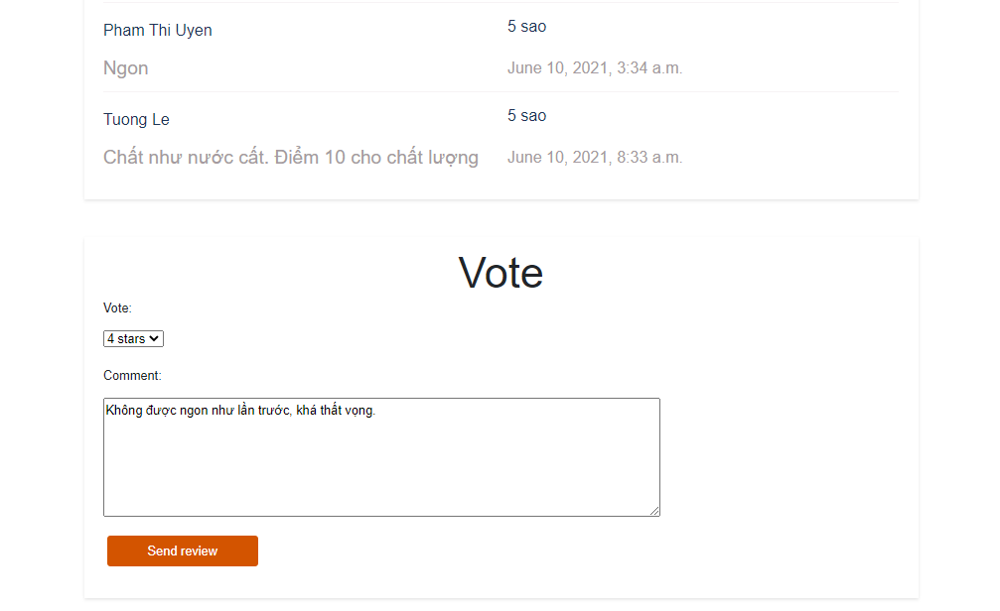

# Coffee Bar Review

Coffee Bar Review là 1 ứng dụng để khách hàng có thể tạo tài khoản, đăng nhập và đánh giá các quán cafe. 

Ứng dụng hiển thị thông tin các quán cafe theo mức độ đánh giá của khách hàng, quán nào được đánh giá cao hơn sẽ hiển thị lên trên.

Khách hàng có thể vào trang web để xem thông tin quán, menu quán và xem đánh giá của mọi người trước khi quyết định có nên tới quán đó để trải nghiệm không.

Ứng dụng được viết bằng Django, dễ dàng cài đặt trên cả Window và MacOS, giao diện trực quan dễ sử dụng.

## Quản trị viên

Đưa thông tin của các quán cafe lên trang web (tên, mô tả, địa chỉ, ảnh, menu).

Quản trị viên sẽ cho hiển thị lên đầu trang web các quán được đánh giá cao hơn. 

## Khách hàng

Khách hàng có thể vào xem thông tin quán và đánh giá (từ 1 đến 5 sao) và có thể để lại feedback. 

Khách hàng có thể đánh giá nhiều lần.

# Nhóm tác giả: ccmtptpm 18-0104_nhóm06

Thành viên: 

* Nguyễn Đình Toản 18CNTT4
* Ngô Lê Thủy Tiên 18CNTT4
* Nguyễn Thị Tường Lê 18CNTT4
* Phạm Thị Uyên 18CNTT4
* Hồ Thị Thanh Huyền 18CNTT4
* Trần Nhật Duy 18CNTT2

# Database

<h1 align="center"></h1>

# Hướng dẫn sử dụng

## Chạy chương trình

Vào terminal gõ lệnh:

```
python manage.py runserver 
```

## Trang admin

http://127.0.0.1:8000/admin/

Username: admin

Password: admin

### Site Admin 

<h1 align="center"></h1>

### User

<h1 align="center"></h1>

### Coffee Bar

<h1 align="center"></h1>

### Review

<h1 align="center"></h1>

## Trang review

http://127.0.0.1:8000/reviews/

### Trang chủ

<h1 align="center"></h1>

### Detail

<h1 align="center"></h1>

<h1 align="center"></h1>

<h1 align="center"></h1>

<h1 align="center"></h1>

### Đăng ký

<h1 align="center"></h1>

<h1 align="center"></h1>

### Đăng nhập

<h1 align="center"></h1>

<h1 align="center"></h1>

### Vote và review

Ban đầu quán The Coffee House có lượt vote trung bình là 5 sao.

<h1 align="center"></h1>

Ta thêm 1 đánh giá 4 sao và nhấn Send review.

<h1 align="center"></h1>

Lượt vote trung bình của quán The Coffee House đã thành 4.8 sao

<h1 align="center"></h1>

Comment ta vừa gửi đã được hiển thị vào phần review quán.

<h1 align="center"></h1>

Ở ngoài trang chủ, lượt vote trung bình quán The Coffe House cũng đã thành 4.8 sao.

<h1 align="center"></h1>


